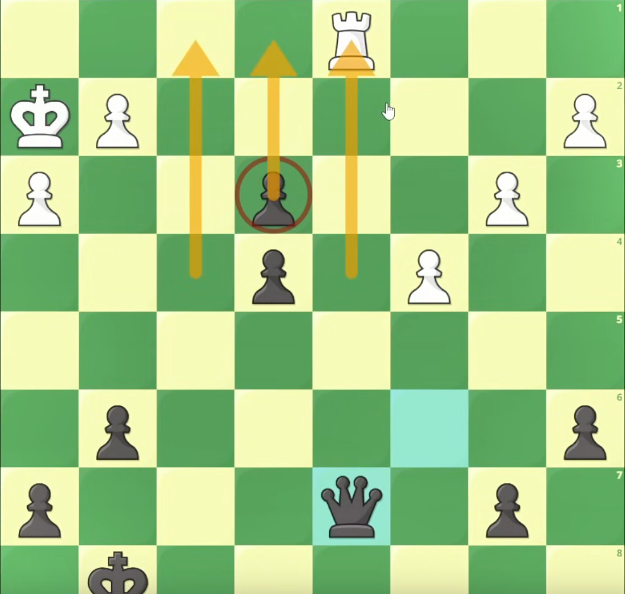

# Curso Completo de Táctica en Ajedrez - Método Gascón _(1:29:07)_

### Jugadas forzadas

Obligar al rival a actuar dejándolo con pocas opciones (Jaque>capturas>amenazas)

---

### Peón pasado

Peon que _(al estar llegando a coronar)_ no tiene peones enemigos en su columna ni en las dos columnas adyacentes _(por delante)_.

## 

## Motivos tácticos

"Señales" o "patrones" típicos que suelen aparecer recurrentemente en partidas, es importante aprender a reconocerlos:

1. **REY DÉBIL**: Rey en el centro, con pocos defensores, rey enemigo con nuestras piezas cercanas, rey con poca movilidad;
2. **PIEZAS PROBLEMÁTICAS:** Piezas **clavadas** _(Una pieza no se puede mover porque dejaría al rey en jaque)_, **indefensas**, **mal defendidas** _(muchas variantes: mismo numero de atacantes y de defensores, defendida solo por el rey, pieza defendida por otra pieza a su vez en peligro)_, **sobrecargadas** _(defiende demasiadas cosas al mismo tiempo)_, con **poca movilidad**;
3. **PEONES FUERTES:** Peones muy avanzados (+ avanzado +fuerte)
4. **MOTIVOS GEOMÉTRICOS:** Se detecta determinada casilla donde _si determinada pieza llegase a ella_ se podría hacer mucho daño (mate, clavar).

---

### Ejemplos prácticos

#### REY DÉBIL

```chess
fen: 6nk/pp4pp/1r4b1/3p1nN1/q7/7Q/PPPB1NPP/1K1R4 w - - 0 1
```

Rey negro débil encerrado con poca movilidad

```chess
fen: 3q4/p2rRpkp/1p4p1/2p5/3p4/1P1P3P/P1P2PP1/4Q1K1 w - - 0 1
```

Otro caso de rey negro débil, la dama y la torre negras no están defendiendo directamente al rey

```chess
fen:5r2/KP6/2P3Q1/P7/2pN2Pq/kp4b1/p3R2p/8 w -
```

Rey blanco solitario
<br><br>

#### PIEZA CLAVADA

```chess
fen:8/ppq2k1p/4p1p1/1P2Pp2/5P2/N1b4P/P5PK/2Q5 w - - 0 1
```

El alfil negro está clavado, si se mueve queda desprotegida la dama
<br><br>

#### PIEZA INDEFENSA

```chess
fen: 2n3k1/5pp1/1p2qb1p/pP6/P1r1pP2/BQ2P3/6PP/1N1R2K1 w - - 0 1
```

La dama blanca está indefensa
<br><br>

#### MAL DEFENDIDA

```chess
fen:1rb2nk1/p1r1qppp/4p3/2P5/4B1N1/P5Q1/5PPP/R3R1K1 w - - 0 1
```

torre c7, defendida por su dama pero a su vez atacada por dama blanca (atacantes == defensores MALO!)
<br><br>

#### SOBRECARGADA

```chess
fen:r7/6R1/4q2p/2p5/1P4Pk/2P5/4r1PK/1R1Q4 w -
```

Si el peon en g2 se moviera a g3 sería jaque mate (motivo geometrico)

## Temas tácticos

Procedimientos o metodos que utilizamos para aprovechar los motivos detectados

1. desviación;
2. atracción;
3. eliminación de la defensa;
4. ataque doble;
5. ataque a la descubierta;
6. despeje de una casilla;
7. despeje de una línea;
8. clavada;
9. obstrucción;
10. rayos x.
