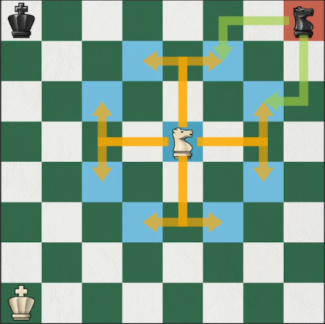
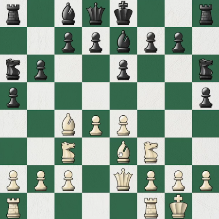

## Qué es la apertura?

Fase inicial del juego que termina cuando se consigue:

- control del centro
- piezas desarrolladas
- rey seguro
- torres unidas

la apertura no termina al mismo tiempo que el rival. Cuando se termina la apertura se inicia el **ataque**.

### Controlar centro

más casillas más posibilidades, la pieza se puede mover rápidamente para cualquier dirección

como se puede ver en la imagen, caballo blanco tiene amplitud de movimiento, caballo negro poca movilidad _"ataca"_ solo dos casillas.

### Rápido desarrollo

Las piezas _(alfiles, caballos, torres y dama)_ deben jugar en **equipo** para poder apoyarse mutuamente.
Desarrollar las piezas a casillas **estables** donde las piezas del rival (de menor valor) no nos pueda atacar.

### Seguridad rey

Sencillamente el **enroque**, rey se aleja del centro, de las otras piezas

### Conectar las torres

que ambas torres se estén _"mirando"_. Si tenemos las torres conectadas hicimos los anteriores pasos bien.

Ejemplo de apertura completada exitosamente

_En este ejemplo se pueden ver todos los pasos de una apertura correcta 1. control del centro con ambos peones; 2. Piezas desarrolladas (alfiles, caballos, dama) apuntando hacia el centro; 3. Rey asegurado mediante el enroque; 4. Torres conectadas_

## Glosario

**_Clavada relativa_**: La pieza legalmente se puede mover pero al hacerlo deja en peligro otra pieza de mayor valor.

**_clavada absoluta_**: la pieza no se puede mover bajo ningún concepto. Ejemplo: al mover la pieza queda el rey en jaque.

---

### Consejo

**Recordar** que en el ajedrez el _material_ no es el factor mas importante. Hay que priorizar **_seguridad del rey_** y **_actividad de las piezas_**
