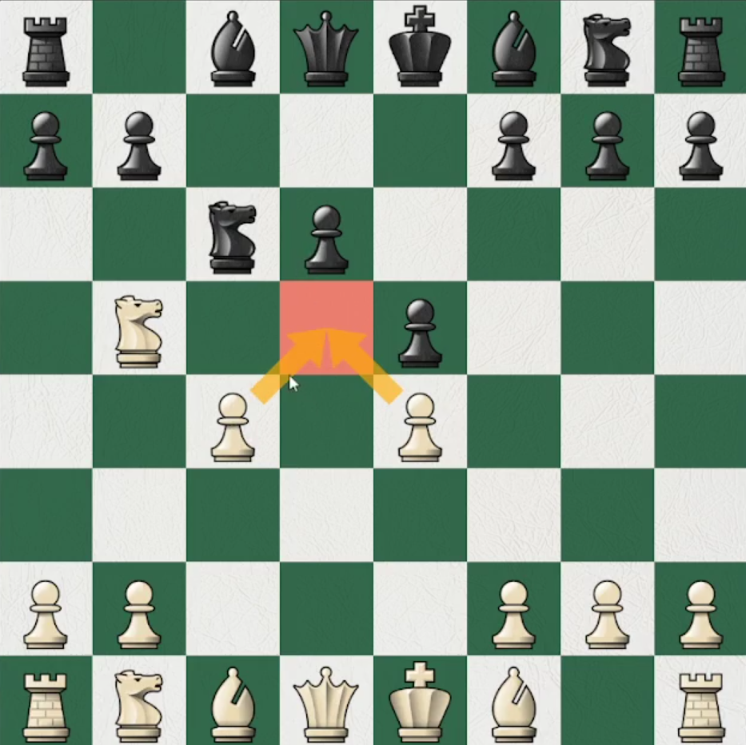
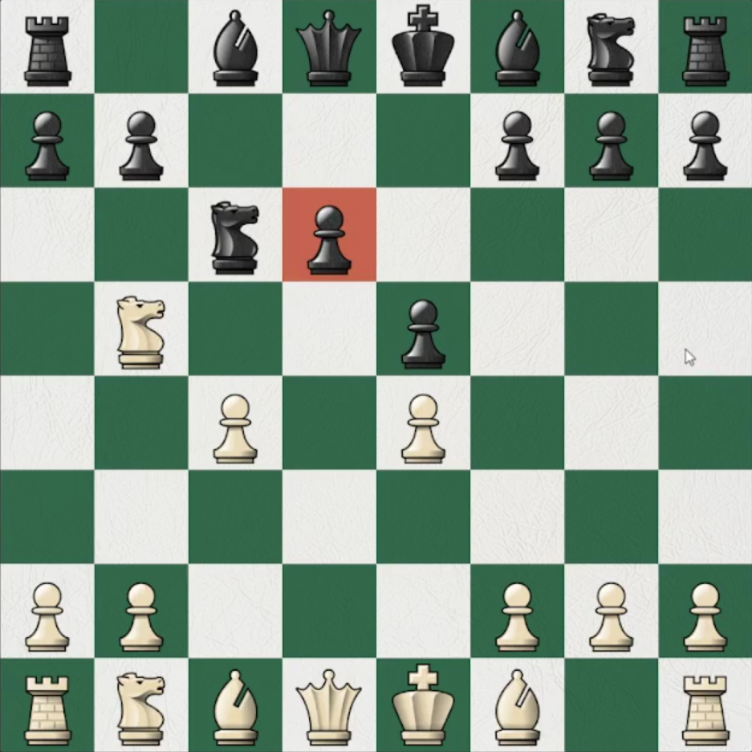

# Principios del ataque

> _"El bando con ventaja debe atacar"_ Wilhem Steinitz

Dese un punto de vista más moderno no siempre es así.

**Control del centro** y **ventaja de desarrollo** dan ventaja en el ataque

## Algunos tips

Hay que encontrar las **debilidades** enemigas.

### Casilla débil

_Casilla débil_ (para el rival) es cualquier casilla defendida por uno de nuestros peones y no atacada por ningún peón rival. Podemos poner una pieza nuestra y no estará en peligro. (Todo se centra en los peones, puede estar atacada por otra pieza del rival y ser débil)

 

### Peón débil

_Peón débil:_ peon que no puede ser defendido por otro peón.

Hay que encontrar debilidades o crearlas si no hay para determinar hacia donde deben ir y presionar nuestras piezas.
